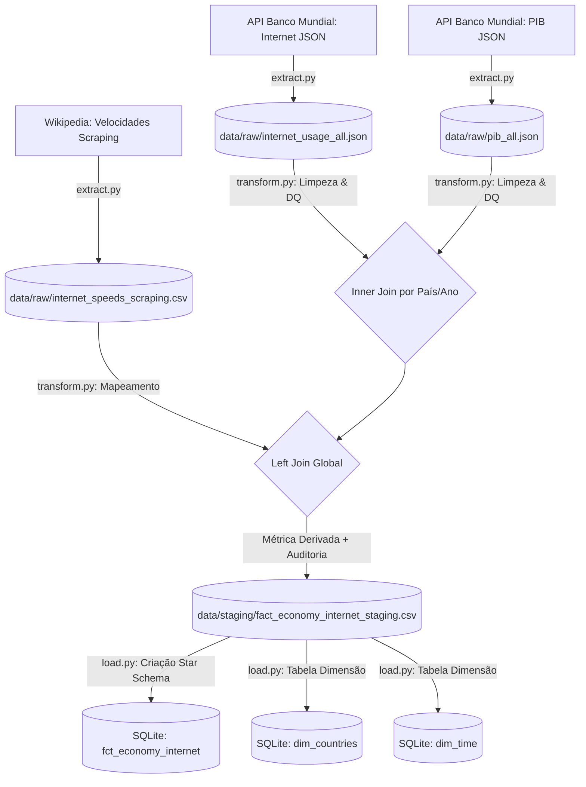

# Projeto ETD

O objetivo principal deste projeto é conceber e implementar um pipeline de dados (ETL) para analisar a relação entre o desenvolvimento económico (PIB) e a infraestrutura digital (Uso e Velocidade de Internet) à escala global.

**Estado Atual:** Semana 3 (Load / Modelação de Dados) concluída.

---

# 1. Fontes de Dados (Extract)
A extração foca-se em três pilares, garantindo a rastreabilidade e integridade:
* **API Banco Mundial (JSON):** Recolha dos indicadores de Penetração de Internet (`IT.NET.USER.ZS`) e PIB (`NY.GDP.MKTP.CD`). Implementada com paginação (1000 registos/página) para eficiência.
* **Wikipedia (Scraping/CSV):** Extração de Velocidades de Internet via *scraping* da lista global de países. Implementado com *User-Agent* para garantir acessibilidade e evitar bloqueios.
* **Licenciamento:** Dados públicos sob a licença *World Bank Dataset Terms of Use* (CC-BY 4.0).

---

# 2. Estrutura do Repositório
```plaintext
├── data/
│   ├── raw/                 # Dados brutos (JSON/CSV)
│   ├── staging/             # Dados limpos e integrados (CSV intermédios)
│   └── economia_internet.db # Base de dados SQLite (Modelo Dimensional)
├── src/
│   ├── extract.py           # Extração e download de dados
│   ├── transform.py         # Limpeza, Data Quality e cruzamento
│   └── load.py              # Modelação em Star Schema e carregamento SQL
├── docs/                    # Relatórios e documentação adicional
├── .env                     # Configurações de API 
├── requirements.txt         # Dependências do projeto
└── README.md                # Documentação principal
```

# 3. Arquitetura do Pipeline


    
# 4. Fases do Pipeline e Decisões Técnicas
Semana 1: Extração (Raw)

- Os ficheiros são guardados com prefixos claros e no formato original (json/csv) na camada raw, garantindo a reprodutibilidade.

- Tratamento de bloqueios de scraping 403 com injeção de Request Headers simulando um navegador. Registo visual na consola para monitorizar o estado das chamadas à API.

Semana 2: Transformação (Staging & Data Quality)

- Conversão de strings e campos aninhados em tipos numéricos (float e int).

- Remoção de registos com indicadores essenciais nulos, forçamento de intervalos lógicos (Internet % restrita a [0, 100], PIB estritamente positivo).

- Resolução de divergências de nomes (ex: "Russia" para "Russian Federation") para garantir um Join eficaz entre o Banco Mundial e a Wikipedia.

Semana 3: Carregamento (Load & Star Schema)

- Escolha do SQLite embutido para garantir portabilidade e fácil execução local.

- Criação de um Star Schema com as tabelas dim_countries, dim_time e a tabela central fct_economy_internet, com chaves primárias e estrangeiras a garantir integridade referencial.

- Script integrado que verifica de forma autónoma se o volume de dados na tabela de factos corresponde exatamente aos registos transformados na staging area.

# 5. Como Executar o Projeto
Instalar dependências:

pip install -r requirements.txt

Configurar variáveis de ambiente:
Cria um ficheiro .env na raiz do projeto com o seguinte conteúdo:

Fragmento do código
API_URL=[https://api.worldbank.org/v2](https://api.worldbank.org/v2)

Executar as fases do Pipeline sequencialmente:

## 1: Extração de Dados
python src/extract.py

## 2: Transformação e Qualidade
python src/transform.py

## 3: Carregamento para a Base de Dados
python src/load.py

---
